# Dashboard UX Research & Redesign Proposal

## Objective
Re-evaluate the current Dashboard design to ensure it provides clarity, purpose, and drives engagement for children, aligning with industry best practices and successful competitor patterns.

## Current State Analysis (LumiLibro "Lantern Room")
*   **Metaphor:** Immersive 3D room with clickable zones (Treehouse, Building, Backpack).
*   **Pros:** Visually immersive, "magical" feel, distinctive style.
*   **Cons:**
    *   **Hidden Affordances:** Clickable zones rely on hovering or knowing where to click. Distant objects (Treehouse) might feel decorative.
    *   **Equal Weighting:** "Stories", "Agency", and "Word Rush" compete equally. No clear "Start Here" for a new user.
    *   **Text Reliance:** Floating labels ("Magic Stories: Read & Create") are text-heavy for pre-readers.
    *   **Small Touch Targets:** Top-right toolkit buttons are relatively small for young hands.

## Competitor Analysis
### 1. Khan Academy Kids ("The Big House")
*   **Key Insight:** **Dual Navigation Path**.
    *   **Path A (Guided):** A huge, pulsing "Green Play Button" in the center. One click starts a personalized activity. Zero friction.
    *   **Path B (Free Choice):** A clear "Library" book icon in the top corner for browsing.
*   **Characters:** Animal friends sit at the bottom, clickable for mini-interactions.

### 2. Kiddopia ("The Carnival/City")
*   **Key Insight:** **Open Exploration**.
    *   Vibrant, distinct buttons/buildings for categories.
    *   No text labels on main icons, just clear visuals (ABC, 123, Paintbrush).
*   **Navigation:** Side-scrolling world to reveal more options without cluttering one screen.

## Concept Validation: The Agency vs. The Storybook

The user has identified a critical strategic question: **Is the "Agency" (Mystery) loop truly the best driver, or is "Story Creation" (Family Bonding) the stronger hook?**

### 1. The Agency Model (Current "Game" Loop)
*   **Concept:** "Carmen Sandiego" style. Get a mission -> Go to a location -> Interrogate a character -> Solve logic puzzle.
*   **Pros:**
    *   **Context for Chat:** It solves the "Why am I talking to this AI?" problem. "Practice Spanish" is boring for kids; "Find the thief" is compelling.
    *   **Gamification:** Clear goals (find the clue), tangible rewards (treasures).
*   **Cons (Current Implementation):**
    *   **High Friction:** "Start Case" -> "Read Brief" -> "Go to Map" -> "Search for Icon" -> "Start Chat". This acts as a barrier to entry.
    *   **Solo Focus:** Tends to be a solo "game" rather than a shared family activity.

### 2. The Storybook Model (Creative Loop)
*   **Concept:** "Mad Libs on Steroids". Choose a hero/setting -> Generate a bilingual story -> Read it together.
*   **Pros:**
    *   **Intrinsic Motivation:** Kids love *making* things. The "I made this!" feeling is powerful.
    *   **Family Bonding:** It's designed to be read *with* a parent (scaffolding the language learning).
    *   **Retention:** Families return to read their *own* library.
*   **Cons:**
    *   **"Blank Page" Syndrome:** Can be intimidating to start without prompts.
    *   **Passive Learning:** Reading is more passive than the active recall required in the Mystery chat.

### 3. Competitor Check
*   **Khan Academy Kids:** Heavily leans on the **Library/Story** model (reading books is the core activity), but uses **Characters** as the "fun" hook.
*   **Duolingo:** All about the **Game Path** (Agency equivalent). Very little creative freedom.
*   **LingoKids:** Uses a mix: "Play" (Games) and "Video/Read" (Passive).

### Strategic Recommendation: The "Dual Heart" Approach
We shouldn't kill the Agency, because **active conversation** is the unique technical value prop (the "Antigravity" magic). However, we should **remove the friction** and elevate Story Creation.

#### Design Pivot
1.  **Streamline Agency:** Remove the "Map Hunting" step.
    *   *Old:* Start Mystery -> Read Clue -> Go to Map -> Find Baker -> Chat.
    *   *New:* "Detective! The Baker needs you!" -> **[Talk to Baker]** (One click launch).
2.  **Elevate Story Creation:** It promotes "Family Bonding". It needs to be **Right Beside** the Mystery button, not hidden in a bookshelf.

#### Updated Wireframe Idea: "Sun & Moon"
*   **☀️ Day Mode (The Mystery):** "Let's Go!" (Active, energetic, solo or guided play).
*   **🌙 Night Mode (The Story):** "Bedtime Story" (Calm, creative, parent-child bonding).

### Visual Mockup

### Revised User Flow

```mermaid
graph TD
    Home[🏠 The Clearing]

    %% The Visual Choice
    Home -->|Click Sun ☀️| MysteryPath[Active Mode]
    Home -->|Click Moon 🌙| StoryPath[Calm Mode]

    %% Active Path (The Mystery)
    MysteryPath -->|Logic| CheckState{Active Case?}
    CheckState -->|Yes| Clue[Resume Chat/Clue]
    CheckState -->|No| NewCase[Start New Mystery]

    %% Calm Path (The Story)
    StoryPath -->|Logic| Library[Show Bookshelf]
    Library -->|Action| Create[Create New Story]
    Library -->|Action| Read[Read Saved Story]

    %% Dock
    Home -->|Dock| Backpack[Backpack/Badges]
    Home -->|Dock| Map[Town Map]
```

### Mobile Adaptation (Portrait)
For mobile devices, the side-by-side layout naturally flows into a vertical stack.

*   **Stacking Order:**
    1.  **Sun (Top):** Active play feels more naturally "high energy" / top-of-mind.
    2.  **Moon (Bottom):** Relaxed play sits below.
*   **Touch Targets:** Each card consumes ~40% of the vertical screen real estate, ensuring impossible-to-miss targets for small fingers.

### Layout Specs (For Implementation)
1.  **Split Control:** A central container with two massive touch targets (Sun Card / Moon Card).
2.  **Responsiveness:**
    *   *Desktop/Tablet Landscape:* `flex-row`, 50% width each.
    *   *Mobile Portrait:* `flex-col`, 50% height each.
3.  **Background:** A parallax forest clearing. The lighting changes based on which hover state is active (Brighter for Sun, Twilight for Moon).
4.  **Bottom Dock:** A fixed glass-morphism bar with large **Map** and **Backpack** icons.
5.  **No Text (Default):** Icons should speak for themselves. Optional toggle for "Show Labels".

### Final Expert Polish: Hooks & Engagement
To move from "Good Design" to "Addictive & Educational", we need to add specific retention hooks.

#### 1. The Daily "Sparkle" (Retention Hook)
*   **The Problem:** The current design waits for the child to *choose* work. We need a reason for them to open the app even if they don't feel like "working".
*   **The Fix:** **The Daily Chest**.
    *   *Visual:* A small treasure chest or glowing lantern sits in the clearing.
    *   *Interaction:* Tapping it gives a small reward (a sticker, a fun fact, or 5 "Sparkles") just for showing up.
    *   *Placement:* Sitting quietly at the roots of the Sun/Moon tree.

#### 2. Lumi as the "Host" (Emotional Hook)
*   **The Problem:** The screen is static. It needs life.
*   **The Fix:** **Lumi the Firefly** (or Lantern Character).
    *   *Behavior:* Lumi hovers in the center. If the child does nothing for 10 seconds, Lumi flies to the "Sun" and bounces, helping guide them.
    *   *Feedback:* When a child finishes a story, Lumi does a happy dance in the Clearing.

#### 3. "Poke the World" (Delight Hook)
*   **The Problem:** Kids love to touch everything, not just buttons.
*   **The Fix:** **Interactive Scenery**.
    *   *Leaves:* Rustle when tapped.
    *   *Fireflies:* Scatter when touched.
    *   *Hidden Easter Eggs:* Tapping the tree trunk 3 times wakes up a sleepy owl. usage: *Kiddopia does this masterfully.*

### Revised Layout with Hooks
*   **Center:** Sun/Moon Cards.
*   **Floating Center:** Lumi (Guide).
*   **Bottom Left (Ground):** Daily Chest (If not claimed).
*   **Background:** Parallax forest with clickable zones.
