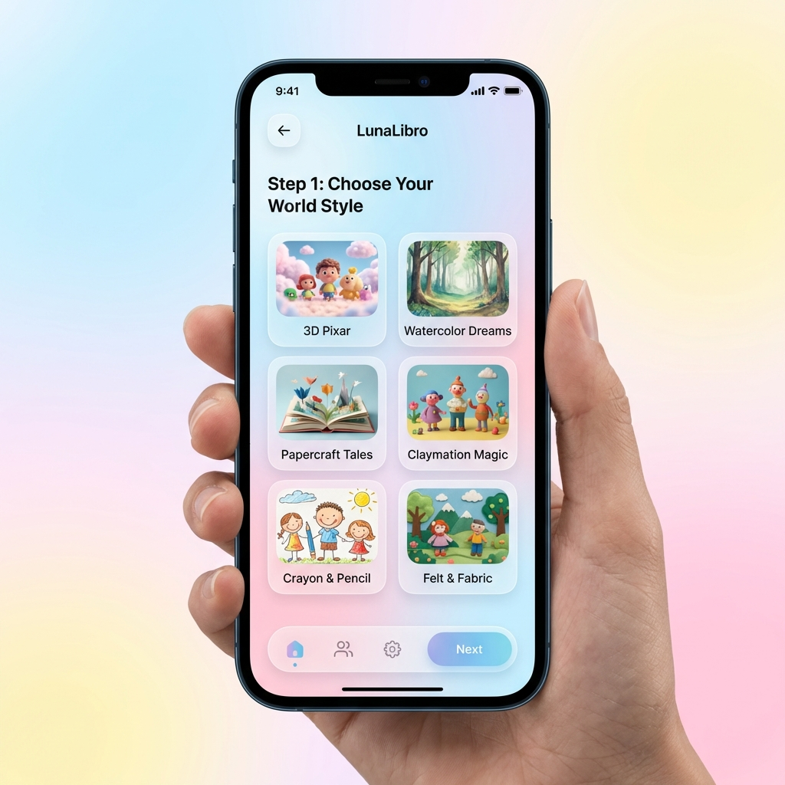
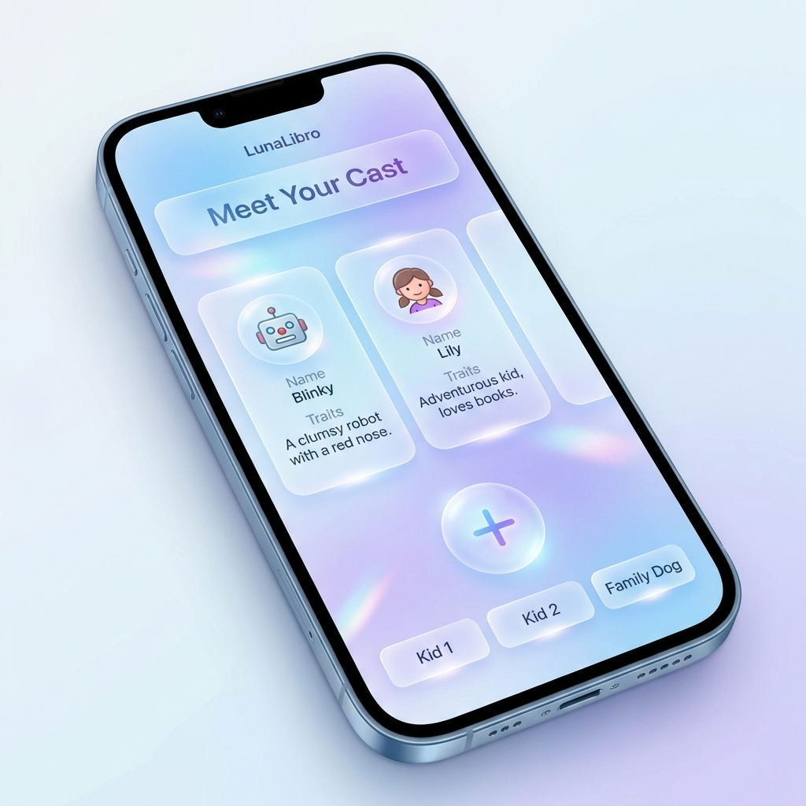
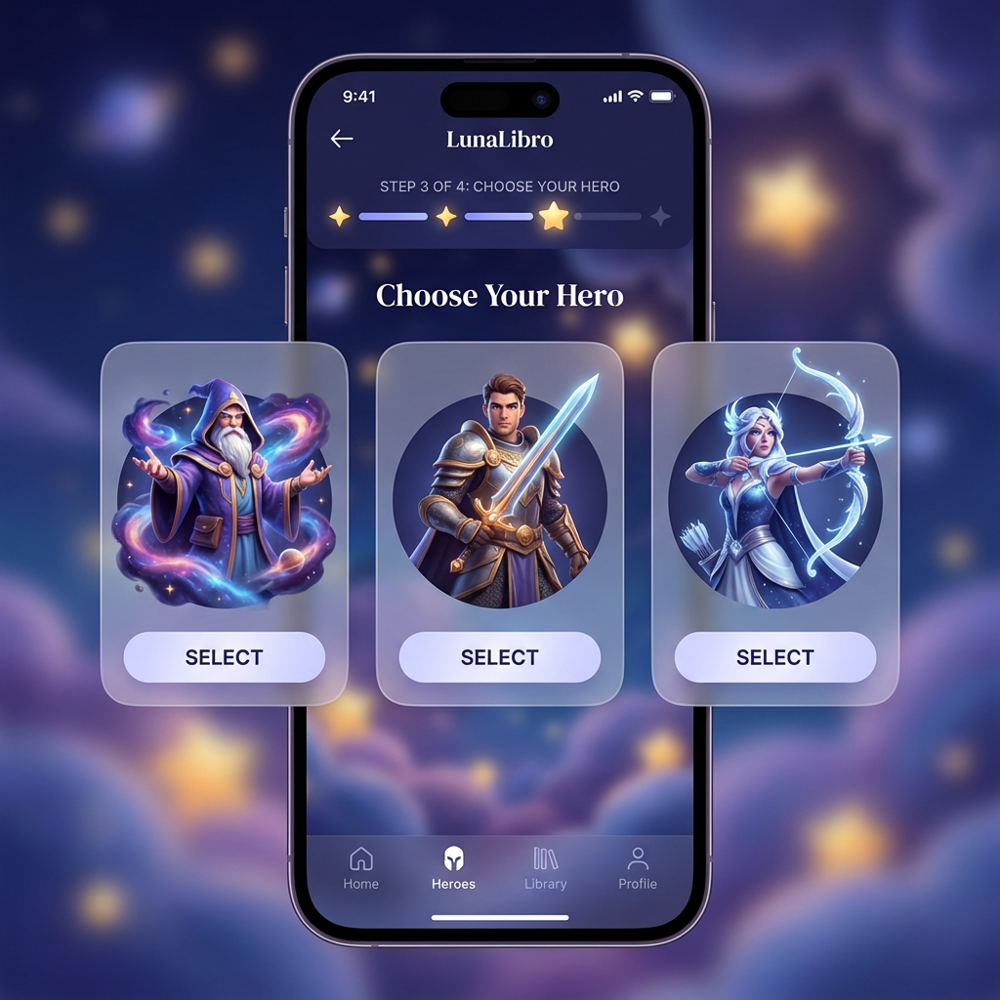

# Wireframes: New Story Creation Flow

This document outlines the proposed user interface and experience for the upgraded LunaLibro story creation pipeline.

## Flow Overview
The new flow moves from broad creative choices to specific character anchoring to ensure total visual consistency.

---

### Step 1: Style Selection
Users choose the visual "soul" of their book. This selection locks in the "Style Anchor" prompt for every subsequent generation.

**Key Features:**
- Visual grid of 6 curated AI styles.
- Clear descriptions (e.g., "3D Pixar", "Watercolor Dreams").
- Glassmorphism UI for a premium, magical feel.

---

### Step 2: Cast Setup
Families define the heroes of the story. Users can add multiple children, pets, or imaginary friends.

**Key Features:**
- Dynamic "Add Member" logic.
- Fields for **Name** and **Visual Traits** (GPT-4o will use these to build the portrait prompts).
- Horizontal card navigation.

---

### Step 3: Portrait Selection (The Hero Choice)
The system generates portrait candidates for each cast member using the selected style. Users pick their favorite to "lock" the character's identity.

**Key Features:**
- High-quality portrait previews.
- Simple 'Select' interaction.
- Visual confirmation of the "Hero" identity before the full book generation starts.

---

### Step 4: Final Generation
Once the cast is locked, the app uses the Master Portraits as **Character References** (`--cref`) in Leonardo.ai to generate the 10-page book with perfect consistency.
